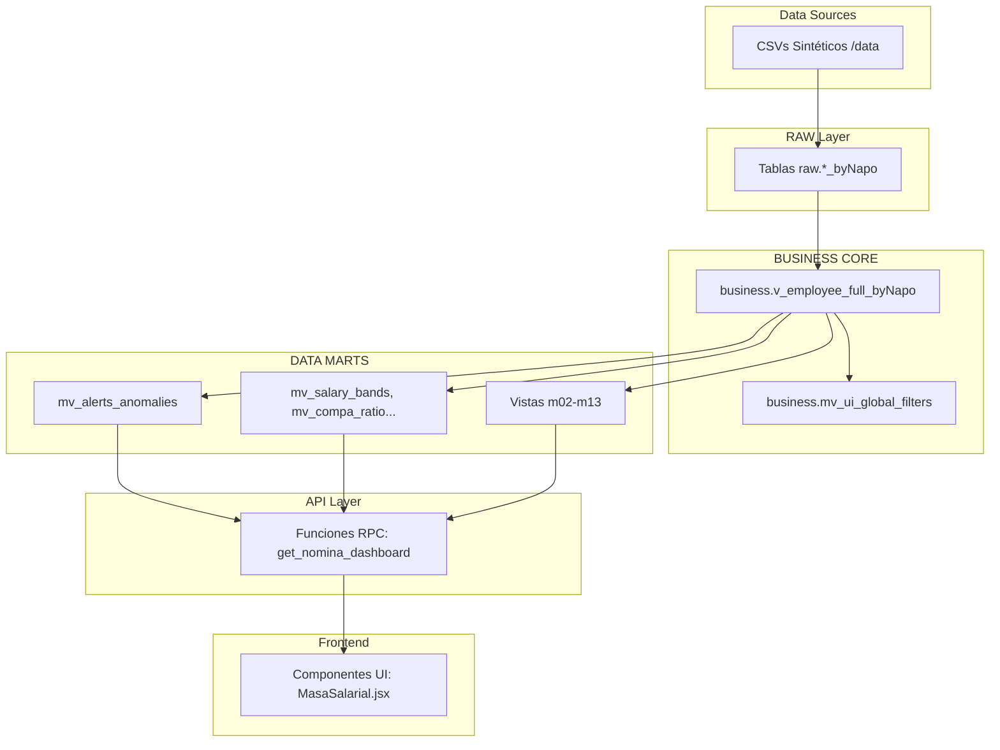

# 📊 Enterprise HR Analytics Dashboard — GDH Analytics

> **Gestión del Desarrollo Humano** | Plataforma Analítica Enterprise de RRHH
>
> **Última actualización:** 2026-05-03 22:08:09 UTC
> **Versión del proyecto:** v 2.0.0
> **Estado:** 🟡 En desarrollo activo

---

## 📑 Tabla de Contenidos

- [Visión General](#-visión-general)
- [Stack Tecnológico](#-stack-tecnológico)
- [Arquitectura del Sistema](#-arquitectura-del-sistema)
- [Módulos Funcionales](#-módulos-funcionales)
- [Inicio Rápido](#-inicio-rápido)
- [Instalación y Configuración](#-instalación-y-configuración)
- [Pipeline ETL](#-pipeline-etl)
- [Estructura del Proyecto](#-estructura-del-proyecto)
- [Base de Datos](#-base-de-datos)
- [Documentación](#-documentación)
- [Contribuir](#-contribuir)
- [Licencia](#-licencia)
- [Sobre el Desarrollador](#-sobre-el-desarrollador)
- [Métricas del Proyecto](#-métricas-del-proyecto)
- [Historial de Actualizaciones](#-historial-de-actualizaciones)

---

## 🎯 Visión General

Plataforma analítica avanzada diseñada para el equipo de Gestión del Desarrollo Humano (GDH), que consolida, procesa y visualiza métricas organizacionales críticas a través de una arquitectura de datos escalable. El enfoque supera el reporte estático tradicional, ofreciendo un modelo interactivo, dinámico y predictivo de People Analytics que brinda a los líderes de talento información centralizada para la toma de decisiones.

El sistema está estructurado en 13 módulos analíticos independientes pero interconectados por una única fuente de verdad (Single Source of Truth). Cada módulo se construye sobre la arquitectura Medallion y expone datos mediante funciones RPC de PostgreSQL, garantizando alto rendimiento y bajo consumo en el cliente.

---

## 🛠️ Stack Tecnológico

| Capa | Tecnologías | Versión / Comentario |
|---|---|---|
| **Frontend UI** | React, Vite | React ^19.2.4, Vite ^8.0.1 |
| **Estilos & Íconos** | Tailwind CSS, Lucide | Tailwind ^4.2.2, Lucide ^1.7.0 |
| **Visualización** | ECharts (echarts-for-react) | ECharts ^6.0.0 |
| **Backend & ETL** | Python, Pandas, SQLAlchemy | Python 3, SQLAlchemy ^2.0.49 |
| **Base de Datos & Auth** | Supabase, PostgreSQL | @supabase/supabase-js ^2.101.1 |

---

## 🏗️ Arquitectura del Sistema



Patrones implementados: **Medallion Architecture**, pre‑agregación mediante vistas materializadas y filtros globales estandarizados.

---

## 📦 Módulos Funcionales

| # | Módulo | Estado en `App.jsx` | Archivos Principales |
|---|---|---|---|
| 01 | Visión Ejecutiva | Activo | AlertasAnomalias, Benchmarking |
| 02 | Reclutamiento & Selección | Activo | EficienciaCiclos, CalidadContratacion, FitScore |
| 03 | Onboarding & Integración | Activo | ProcesosActivos, TiempoProductividad, RotacionTemprana |
| 04 | Ciclo de Vida & Clústeres | Activo | ComportamientoGrupos, CausalidadCorrelaciones |
| 05 | Fuerza Laboral & Estructura | Activo | Demographics, OrgStructure, EmployeeTable |
| 06 | Nómina, Costos & Equidad | Activo | Compensations, EquidadInterna, CompaRatio, MasaSalarial |
| 07 | Tiempo, Asistencia & Bienestar | Activo | Ausentismo, HorasExtra, MallaVacaciones, SaludOcupacional |
| 08 | Gestión del Desempeño | Activo | Evaluacion360, AvanceOKRs, PlanesMejora |
| 09 | Talento & Desarrollo | Activo | MatrizNineBox, MapaSucesion, BrechasSkills |
| 10 | Engagement & Sentimiento | Activo | EngagementENPS, HeatmapEngagement, DiversidadInclusion |
| 11 | Compliance & Relaciones | Activo | CumplimientoLaboral, RelacionesSindicales |
| 12 | Retención & Riesgo de Fuga | Activo | ScoreFuga, BenchmarkingTurnover, CorrelacionManager |
| 13 | Calidad de Datos | Activo | LogDatosMaestros, DiccionarioDatos |
| 14 | Administración | ⚠️ Placeholder | - |

---

## 🚀 Inicio Rápido

1. **Clonar el repositorio e instalar dependencias del frontend**
   ```bash
   git clone <repository-url>
   cd hr-analytics-dashboard/client
   npm install
   ```
2. **Configurar variables de entorno**
   Copiar `.env.example` a `.env` en la raíz y en `client/`, rellenar credenciales Supabase.
3. **Ejecutar el pipeline ETL y lanzar la UI**
   ```bash
   cd ..
   python etl_pipeline/00_full_run_pipeline.py
   cd client
   npm run dev
   ```

---

## 📥 Instalación y Configuración

El proyecto requiere los siguientes archivos `.env`:
- `VITE_SUPABASE_URL` – URL del proyecto Supabase.
- `VITE_SUPABASE_ANON_KEY` – llave pública para el cliente.
- `SUPABASE_SERVICE_KEY` – llave de servicio (secreto).
- `DATABASE_URL` – cadena de conexión directa a PostgreSQL.

Utilice el archivo `.env.example` como plantilla.

---

## 🔄 Pipeline ETL

| Fase | Script | Función |
|---|---|---|
| **01 Generación** | `01_generate_synthetic_data.py` | Crea 22 CSV sintéticos. |
| **02 RAW** | `02_setup_raw_layer.py` | Crea esquemas `raw.*`. |
| **03 Ingesta** | `03_ingest_data.py` | Carga CSV → PostgreSQL. |
| **04 Core** | `04_setup_business_core.py` | Construye vista `v_employee_full_byNapo` y filtros. |
| **Marts** | `m01_*.py` … `m13_*.py` | Genera vistas materializadas y RPCs. |
| **Meta** | `90_generate_data_inventory.py`, `91_export_data_samples.py`, `92_generate_lineage.py` | Genera catálogos, samples y linaje. |

---

## 📁 Estructura del Proyecto

```text
hr-analytics-dashboard/
├── .env.example
├── .gitignore
├── README.md
├── client/                 # React/Vite frontend
│   ├── package.json
│   ├── src/
│   │   ├── App.jsx
│   │   ├── config/
│   │   └── modules/        # 00‑14 UI modules
├── data/                   # CSVs sintéticos y origen
├── docs/                   # Documentación y prompts
│   ├── 01-product-specs/
│   ├── 02-data-governance/
│   └── 03-ai-generated-content/
└── etl_pipeline/           # Scripts Python del ETL
    ├── 00_full_run_pipeline.py
    └── m01_*.py … m13_*.py
```

---

## 🗄️ Base de Datos

Arquitectura Medallion en PostgreSQL:
1. **RAW** – Tablas crudas (`raw.*_byNapo`).
2. **BUSINESS** – Vista única `business.v_employee_full_byNapo` (SSOT) y filtro `business.mv_ui_global_filters`.
3. **DATA MARTS** – Vistas materializadas (`mv_*`) que precalculan KPIs para cada módulo y son consumidas vía RPCs.

---

## 📚 Documentación

| Pilar | Ruta | Propósito |
|---|---|---|
| **Especificaciones de Producto** | `docs/01-product-specs/` | Roadmap, sitemap y design system. |
| **Gobernanza de Datos** | `docs/02-data-governance/` | Diccionario, muestras y linaje. |
| **Contenido Automatizado** | `docs/03-ai-generated-content/` | Blueprint, data dictionary y audit report. |

---

## 🤝 Contribuir

1. **Design System** – Use exclusivamente la paleta *Corporate Slate & Blue*; colores genéricos están prohibidos.
2. **Lógica de Negocio** – Evite cálculos pesados en el frontend; delegue a vistas materializadas.
3. **Sincronización** – Tras cualquier cambio estructural, ejecute `python etl_pipeline/00_full_run_pipeline.py`.

---

## 📜 Licencia

> ⚠️ INSTRUCCIÓN PARA EL AGENTE: Copia el siguiente texto literalmente sin modificar.

Este proyecto es de código abierto bajo la Licencia MIT.

---

## 👨💻 Sobre el Desarrollador

**Jesús Napoleón Villegas Gálvez**
Data & Analytics Specialist | Transversal Analytics (People, Finance, Manufacturing) | Power BI | Python | SAP ERP (FI, CO, PP, MM, HCM)

Profesional híbrido especializado en traducir operaciones de negocio complejas en arquitecturas de datos escalables. Con formación en gestión corporativa y actualmente cursando una Maestría en Data Analytics & Inteligencia Artificial (ESAN), diseño soluciones integrales (Data Mesh, ETL, predicción ML) que impactan directamente en la rentabilidad de las empresas.

- 📍 **Ubicación:** Lima, Perú
- 💼 **Rol Actual:** Especialista de Datos Corporativo en SMI (Grupo Intercorp)
- ✉️ **Contacto:** [EMAIL_ADDRESS]
- 🔗 **LinkedIn:** [jesusvillegasg](https://www.linkedin.com/in/jesusvillegasg/)
- 🛠️ **Stack Técnico:** Python, SQL, React, Power BI, GCP, Supabase, automatización RPA y SAP.

---

## 📊 Métricas del Proyecto

| Categoría | Valor | Fuente |
|---|---|---|
| **Módulos Funcionales (UI)** | 13 de 14 | `client/src/App.jsx` |
| **Scripts ETL Totales** | 21 archivos | `etl_pipeline/` |
| **Vistas Materializadas** | >20 MVs | `02_data_dictionary.md` |
| **Documentación** | 12+ documentos | `docs/` |
| **Score de Calidad** | 94/100 | `03_audit_report.md` |
| **Tiempo Pipeline** | ~1‑3 mins | `00_full_run_pipeline.py` |

---

## 📝 Historial de Actualizaciones

| Fecha | Versión | Cambios Principales | Autor |
|---|---|---|---|
| 2026-05-03 | v2.0.0 | Actualización final de README conforme Prompt 90 versión 2.0.0, métricas actualizadas y versión del proyecto fijada. | Napo |
| 2026-05-03 | v0.0.0 | Regeneración total de README vía Prompt 90. Corrección de Mermaid syntax, headers y tabla de historial. | Napo |
| 2026-05-03 | v0.0.0 | Sincronización de documentación (Blueprint, Data Dictionary, Audit Report). Estabilidad total en 13 módulos ETL. | Napo |
| 2026-05-03 | v0.0.0 | Ejecución exitosa de pipeline modular completo y reestructuración de gobernanza. | Napo |

---

> _"Tienes más datos de los que crees. El reto no es recolectarlos, es perderles el miedo y saber hacerles la pregunta correcta."_
> **— Construido por Jesús "Napo" Villegas**

<div align="center">
  <a href="#-enterprise-hr-analytics-dashboard--gdh-analytics">⬆️ Volver al inicio</a>
</div>
