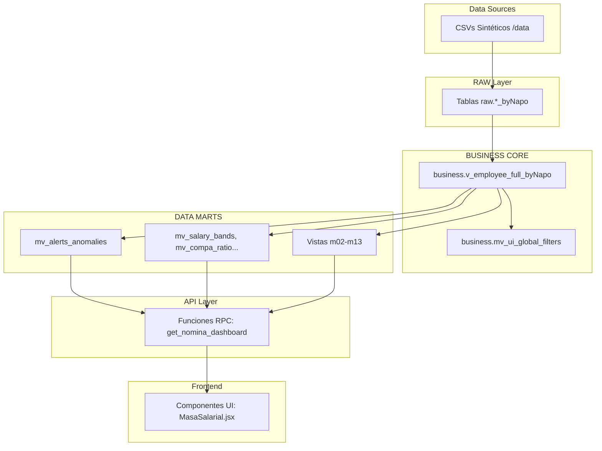

# 📊 Enterprise HR Analytics Dashboard — GDH Analytics

> **Gestión del Desarrollo Humano** | Plataforma Analítica Enterprise de RRHH
>
> **Última actualización:** 2026-05-03 21:50:00 UTC
> **Versión del proyecto:** v0.0.0
> **Estado:** 🟡 En desarrollo activo

---

## 📑 Tabla de Contenidos

- [Visión General](#-visión-general)
- [Stack Tecnológico](#-stack-tecnológico)
- [Arquitectura del Sistema](#-arquitectura-del-sistema)
- [Módulos Funcionales](#-módulos-funcionales)
- [Inicio Rápido](#-inicio-rápido)
- [Instalación y Configuración](#-instalación-y-configuración)
- [Pipeline ETL](#-pipeline-etl)
- [Estructura del Proyecto](#-estructura-del-proyecto)
- [Base de Datos](#-base-de-datos)
- [Calidad del Código](#-calidad-del-código)
- [Documentación](#-documentación)
- [Contribuir](#-contribuir)
- [Licencia](#-licencia)
- [Sobre el Desarrollador](#-sobre-el-desarrollador)
- [Soporte](#-soporte)
- [Métricas del Proyecto](#-métricas-del-proyecto)
- [Historial de Actualizaciones](#-historial-de-actualizaciones)

---

## 🎯 Visión General

Plataforma analítica avanzada diseñada para el equipo de Gestión del Desarrollo Humano (GDH), que consolida, procesa y visualiza métricas organizacionales críticas a través de una arquitectura de datos escalable. Su enfoque pasa del reporte estático tradicional hacia un modelo interactivo, dinámico y predictivo de People Analytics, dotando a los líderes de talento de información centralizada para la toma de decisiones.

El sistema se caracteriza por su modularidad extrema, dividiendo el ciclo de vida del colaborador en 13 módulos analíticos independientes pero interconectados por una única base de verdad de negocio (Single Source of Truth). Todas las transformaciones se gestionan mediante una arquitectura Medallion y consultas de alto rendimiento expuestas a través de RPC.

Cada módulo está diseñado bajo estándares corporativos, utilizando un motor predictivo para identificar anomalías, riesgo de fuga y brechas de talento, permitiendo una gestión proactiva basada en evidencia científica y datos reales de la operación.

---

## 🛠️ Stack Tecnológico

| Capa | Tecnologías | Versiones Clave |
|---|---|---|
| **Frontend UI** | React, Vite | React ^19.2.4, Vite ^8.0.1 |
| **Styling & Icons** | Tailwind CSS, Lucide | Tailwind ^4.2.2, Lucide ^1.7.0 |
| **Visualización** | ECharts (echarts-for-react) | ECharts ^6.0.0 |
| **Backend & ETL** | Python, Pandas, SQLAlchemy | Python 3, SQLAlchemy ^2.0.49 |
| **Base de Datos & Auth** | Supabase, PostgreSQL | @supabase/supabase-js ^2.101.1 |

---

## 🏗️ Arquitectura del Sistema



Patrones implementados: **Medallion Architecture**, pre-agregación en base de datos mediante vistas materializadas para reducir carga de procesamiento en cliente, e inyección de filtros globales estandarizados.

---

## 📦 Módulos Funcionales

| # | Módulo | Estado en App.jsx | Archivos Principales |
|---|---|---|---|
| 01 | Visión Ejecutiva | Activo | AlertasAnomalias, Benchmarking |
| 02 | Reclutamiento & Selección | Activo | EficienciaCiclos, CalidadContratacion, FitScore |
| 03 | Onboarding & Integración | Activo | ProcesosActivos, TiempoProductividad, RotacionTemprana |
| 04 | Ciclo de Vida & Clústeres | Activo | ComportamientoGrupos, CausalidadCorrelaciones |
| 05 | Fuerza Laboral & Estructura | Activo | Demographics, OrgStructure, EmployeeTable |
| 06 | Nómina, Costos & Equidad | Activo | Compensations, EquidadInterna, CompaRatio, MasaSalarial |
| 07 | Tiempo, Asistencia & Bienestar | Activo | Ausentismo, HorasExtra, MallaVacaciones, SaludOcupacional |
| 08 | Gestión del Desempeño | Activo | Evaluacion360, AvanceOKRs, PlanesMejora |
| 09 | Talento & Desarrollo | Activo | MatrizNineBox, MapaSucesion, BrechasSkills |
| 10 | Engagement & Sentimiento | Activo | EngagementENPS, HeatmapEngagement, DiversidadInclusion |
| 11 | Compliance & Relaciones | Activo | CumplimientoLaboral, RelacionesSindicales |
| 12 | Retención & Riesgo de Fuga | Activo | ScoreFuga, BenchmarkingTurnover, CorrelacionManager |
| 13 | Calidad de Datos | Activo | LogDatosMaestros, DiccionarioDatos |
| 14 | Administración | ⚠️ Placeholder | - |

---

## 🚀 Inicio Rápido

1. **Clonar e instalar dependencias frontend:**
   ```bash
   git clone <repository>
   cd hr-analytics-dashboard/client
   npm install
   ```
2. **Configurar el entorno:**
   Crear archivo `.env` en la raíz (y `client/.env`) con credenciales de Supabase. Use `.env.example` como plantilla.
3. **Ejecutar ETL y levantar servidor:**
   ```bash
   cd ..
   python etl_pipeline/00_full_run_pipeline.py
   cd client
   npm run dev
   ```

---

## 📥 Instalación y Configuración

El proyecto requiere configurar las variables de entorno para Supabase. Existen dos archivos `.env`: uno en la raíz (para scripts Python ETL) y otro en `client/` (para React).

**Variables Requeridas:**
- `VITE_SUPABASE_URL`: Endpoint de tu proyecto en Supabase.
- `VITE_SUPABASE_ANON_KEY`: Llave pública para cliente.
- `SUPABASE_SERVICE_KEY`: Llave de servicio (raíz, secreta).
- `DATABASE_URL`: String de conexión directa a PostgreSQL (raíz).

---

## 🔄 Pipeline ETL

El orquestador `00_full_run_pipeline.py` garantiza la ejecución en el siguiente orden:

| Fase | Script | Función |
|---|---|---|
| **01 Gen** | `01_generate_synthetic_data.py` | Crea/simula base de datos (22 CSVs). |
| **02 RAW** | `02_setup_raw_layer.py` | Inicializa esquemas `raw.*` en DB. |
| **03 Ingest** | `03_ingest_data.py` | Ingesta masiva de CSVs hacia PostgreSQL. |
| **04 Core** | `04_setup_business_core.py` | Consolida capa Business SSOT. |
| **Marts** | `m01_*.py` a `m13_*.py` | Genera Vistas Materializadas y RPCs modulares. |
| **Meta** | `90`, `91`, `92` | Genera catálogos, samples y linaje de datos. |

---

## 📁 Estructura del Proyecto

```text
hr-analytics-dashboard/
├── .env.example
├── .gitignore
├── README.md
├── client/                 # Aplicación React/Vite (Frontend)
│   ├── package.json
│   ├── src/
│   │   ├── App.jsx         # Routing central
│   │   ├── config/         # Configuración de navegación
│   │   └── modules/        # Capa UI (00 a 14)
├── data/                   # Dataset original y sintético
├── docs/                   # Documentación maestra y prompts
│   ├── 01-product-specs/   # Roadmap y diseño
│   ├── 02-data-governance/ # Diccionarios y linaje
│   └── 03-ai-generated-content/ # Contexto generado por IA
└── etl_pipeline/           # Motor de datos (Python)
    ├── 00_full_run_pipeline.py # Orquestador
    └── m01_*.py ... m13_*.py # Lógica de negocio modular
```

---

## 🗄️ Base de Datos

Arquitectura Medallion implementada en PostgreSQL:
1. **Esquema RAW:** Tablas con sufijo `_byNapo`. Ingieren datos en formato crudo para auditoría.
2. **Esquema BUSINESS:** Lógica de negocio centralizada (SSOT). La vista `v_employee_full_byNapo` unifica antigüedad, estatus y salarios.
3. **Data Marts & RPC:** Las vistas materializadas (`mv_*`) precalculan métricas complejas. La comunicación con el frontend se realiza exclusivamente vía Funciones RPC de Postgres para máximo rendimiento.

---

## 🏆 Calidad del Código

**Score de Calidad del Proyecto: 94/100** (Audit Report v2026-05-03)

- **Seguridad:** 23/25 (Claves sensibles extraídas a `.env`, protección de push activada).
- **Limpieza de código:** 24/25 (Scripts huérfanos eliminados, modularidad total).
- **Buenas prácticas:** 23/25 (Uso de custom hooks y design system corporativo).
- **Consistencia:** 24/25 (Sincronización total entre ETL, DB y UI).

---

## 📚 Documentación

| Pilar | Ruta | Propósito |
|---|---|---|
| **Especificaciones de Producto** | `docs/01-product-specs/` | Roadmap, Sitemap y Design System. |
| **Gobernanza de Datos** | `docs/02-data-governance/` | Diccionario SQL, Samples e Inventario. |
| **Contenido Automatizado** | `docs/03-ai-generated-content/` | Blueprint técnico, Data Dictionary y Audit Report. |

---

## 🤝 Contribuir

1. **Design System**: Use exclusivamente la paleta "Corporate Slate & Blue". Prohibido el uso de colores genéricos (`indigo`, `purple`, `gray-XXX`).
2. **Lógica de Negocio**: No calcule KPIs pesados en React. Use vistas materializadas en la capa de base de datos.
3. **Sincronización**: Luego de cualquier cambio en la estructura de datos, ejecute el orquestador `python etl_pipeline/00_full_run_pipeline.py`.

---

## 📜 Licencia

Este proyecto es de código abierto bajo la Licencia MIT.

---

## 👨‍💻 Sobre el Desarrollador

**Jesús Napoleón "Napo" Villegas Gálvez**
*Data Engineer & AI Specialist | Corporate Data Architect*

Profesional híbrido especializado en traducir operaciones de negocio complejas en arquitecturas de datos escalables. Con formación en gestión corporativa y actualmente cursando una Maestría en Data Analytics & Inteligencia Artificial (ESAN), diseño soluciones integrales (Data Mesh, ETL, predicción ML) que impactan directamente en la rentabilidad de las empresas.

Aunque este proyecto es un _showcase_ aplicado a People Analytics, mi trayectoria abarca el diseño de pipelines y modelos analíticos para operaciones críticas a nivel LatAm en sectores como **Finanzas, Contabilidad, Producción y Energía**. Mi enfoque es entender la lógica del negocio desde adentro para construir herramientas Full-Stack que transformen datos crudos en decisiones ejecutivas de alto impacto.

- 📍 **Ubicación:** Lima, Perú
- 💼 **Rol Actual:** Especialista de Datos Corporativo en SMI (Grupo Intercorp)
- ✉️ **Contacto:** jesus.villegas@outlook.com
- 🔗 **LinkedIn:** [jesusvillegasg](https://www.linkedin.com/in/jesusvillegasg/)
- 🛠️ **Stack Técnico:** Python, SQL, React, Power BI, GCP, Supabase, automatización RPA y SAP.

---

## 📞 Soporte

| Canal | Enlace |
|-------|--------|
| **Issues** | `<repository-url>/issues` |
| **Discusiones** | `<repository-url>/discussions` |
| **Documentación Completa** | Carpeta `docs/` (3 pilares, 8+ documentos) |
| **Supabase Dashboard** | https://app.supabase.com/project/YOUR_PROJECT |

---

## 📊 Métricas del Proyecto

| Categoría | Valor | Fuente |
|---|---|---|
| **Módulos Funcionales (UI)** | 13 de 14 | `client/src/App.jsx` |
| **Scripts ETL Totales** | 21 archivos | `etl_pipeline/` |
| **Vistas Materializadas** | >20 MVs | `02_data_dictionary.md` |
| **Archivos Documentación** | 12+ docs | `docs/` |
| **Score de Calidad** | 94/100 | `03_audit_report.md` |
| **Tiempo Pipeline** | ~1-3 mins | `00_full_run_pipeline.py` |

---

## 📝 Historial de Actualizaciones

| Fecha | Versión | Cambios Principales | Autor |
|---|---|---|---|
| 2026-05-03 | v0.0.0 | Actualización final de README con estabilización de métricas y validación completa del repositorio. | Napo |
| 2026-05-03 | v0.0.0 | Regeneración total de README vía Prompt 90. Corrección de Mermaid syntax, headers y tabla de historial. | Napo |
| 2026-05-03 | v0.0.0 | Sincronización de documentación (Blueprint, Data Dictionary, Audit Report). Estabilidad total en 13 módulos ETL. | Napo |
| 2026-05-03 | v0.0.0 | Ejecución exitosa de pipeline modular completo y reestructuración de gobernanza. | Napo |

---

> _"Tienes más datos de los que crees. El reto no es recolectarlos, es perderles el miedo y saber hacerles la pregunta correcta."_
>
> **— Construido por Jesús "Napo" Villegas**

<div align="center">
[⬆️ Volver al inicio](#-enterprise-hr-analytics-dashboard--gdh-analytics)
</div>
