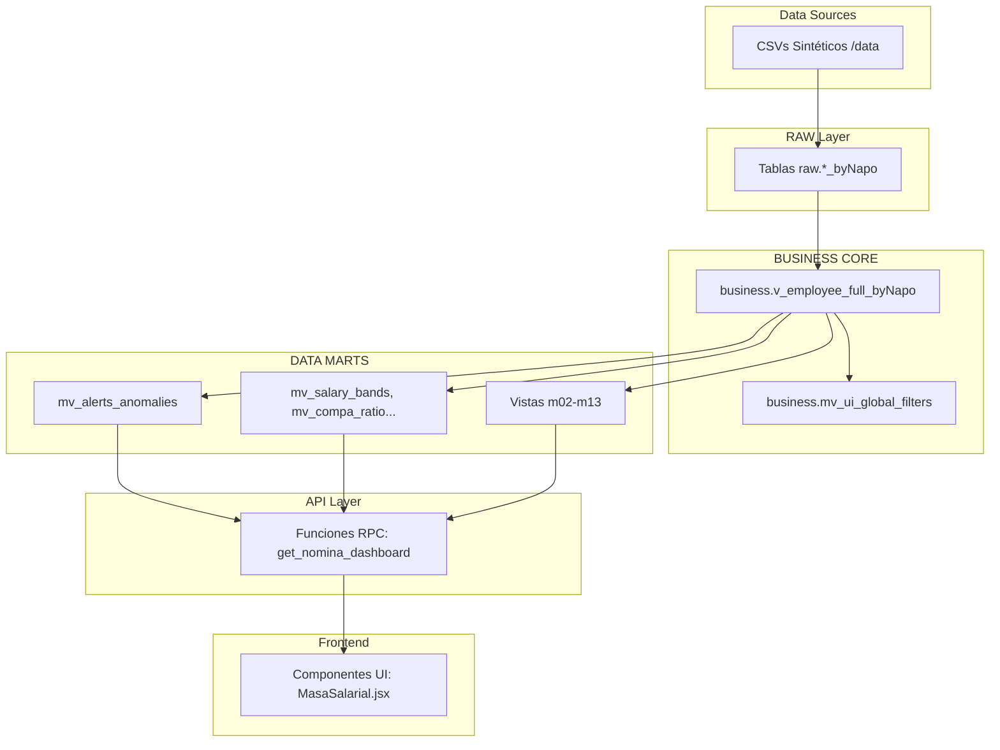

# 📊 Enterprise HR Analytics Dashboard — GDH Analytics

> **Gestión del Desarrollo Humano** | Plataforma Analítica Enterprise de RRHH
>
> **Última actualización:** 2026-05-03 18:23:19 UTC
> **Versión del proyecto:** v0.0.0
> **Estado:** 🟡 En desarrollo activo

---

## 📑 Tabla de Contenidos

- [Visión General](#-visión-general)
- [Stack Tecnológico](#-stack-tecnológico)
- [Arquitectura del Sistema](#-arquitectura-del-sistema)
- [Módulos Funcionales](#-módulos-funcionales)
- [Inicio Rápido](#-inicio-rápido)
- [Instalación y Configuración](#-instalación-y-configuración)
- [Pipeline ETL](#-pipeline-etl)
- [Estructura del Proyecto](#-estructura-del-proyecto)
- [Base de Datos](#-base-de-datos)
- [Calidad del Código](#-calidad-del-código)
- [Documentación](#-documentación)
- [Contribuir](#-contribuir)
- [Licencia](#-licencia)
- [Sobre el Desarrollador](#-sobre-el-desarrollador)
- [Soporte](#-soporte)
- [Métricas del Proyecto](#-métricas-del-proyecto)
- [Historial de Actualizaciones](#-historial-de-actualizaciones)

---

## 🎯 Visión General

Plataforma analítica avanzada diseñada para el equipo de Gestión del Desarrollo Humano (GDH), que consolida, procesa y visualiza métricas organizacionales críticas a través de una arquitectura de datos escalable. Su enfoque pasa del reporte estático tradicional hacia un modelo interactivo, dinámico y predictivo de People Analytics, dotando a los líderes de talento de información centralizada para la toma de decisiones.

El sistema se caracteriza por su modularidad extrema, dividiendo el ciclo de vida del colaborador en 13 módulos analíticos independientes pero interconectados por una única base de verdad de negocio (Single Source of Truth). Todas las transformaciones se gestionan mediante una arquitectura Medallion y consultas de alto rendimiento expuestas a través de RPC.

---

## 🛠️ Stack Tecnológico

| Capa | Tecnologías | Versiones Clave |
|---|---|---|
| **Frontend UI** | React, Vite | React ^19.2.4, Vite ^8.0.1 |
| **Styling & Icons** | Tailwind CSS, Lucide | Tailwind ^4.2.2, Lucide ^1.7.0 |
| **Visualización** | ECharts (echarts-for-react) | ECharts ^6.0.0 |
| **Backend & ETL** | Python, Pandas, SQLAlchemy | Python 3, SQLAlchemy ^2.0.49 |
| **Base de Datos & Auth** | Supabase, PostgreSQL | @supabase/supabase-js ^2.101.1 |

---

## 🏗️ Arquitectura del Sistema



Patrones implementados: **Medallion Architecture**, pre-agregación en base de datos mediante vistas materializadas para reducir carga de procesamiento en cliente, e inyección de filtros globales estandarizados.

---

## 📦 Módulos Funcionales

| # | Módulo | Estado en App.jsx | Archivos Principales |
|---|---|---|---|
| 01 | Visión Ejecutiva | Activo | AlertasAnomalias, Benchmarking |
| 02 | Reclutamiento & Selección | Activo | EficienciaCiclos, CalidadContratacion, FitScore |
| 03 | Onboarding & Integración | Activo | ProcesosActivos, TiempoProductividad, RotacionTemprana |
| 04 | Ciclo de Vida & Clústeres | Activo | ComportamientoGrupos, CausalidadCorrelaciones |
| 05 | Fuerza Laboral & Estructura | Activo | Demographics, OrgStructure, EmployeeTable |
| 06 | Nómina, Costos & Equidad | Activo | Compensations, EquidadInterna, CompaRatio, MasaSalarial |
| 07 | Tiempo, Asistencia & Bienestar | Activo | Ausentismo, HorasExtra, MallaVacaciones, SaludOcupacional |
| 08 | Gestión del Desempeño | Activo | Evaluacion360, AvanceOKRs, PlanesMejora |
| 09 | Talento & Desarrollo | Activo | MatrizNineBox, MapaSucesion, BrechasSkills |
| 10 | Engagement & Sentimiento | Activo | EngagementENPS, HeatmapEngagement, DiversidadInclusion |
| 11 | Compliance & Relaciones | Activo | CumplimientoLaboral, RelacionesSindicales |
| 12 | Retención & Riesgo de Fuga | Activo | ScoreFuga, BenchmarkingTurnover, CorrelacionManager |
| 13 | Calidad de Datos | Activo | LogDatosMaestros, DiccionarioDatos |
| 14 | Administración | ⚠️ Placeholder | - |

---

## 🚀 Inicio Rápido

1. **Clonar e instalar dependencias frontend:**
   ```bash
   git clone <repository>
   cd hr-analytics-dashboard/client
   npm install
   ```
2. **Configurar el entorno:**
   Crear archivo `.env` en la raíz (y `client/.env`) con credenciales de Supabase.
3. **Ejecutar ETL y levantar servidor:**
   ```bash
   cd ..
   python etl_pipeline/00_full_run_pipeline.py
   cd client
   npm run dev
   ```

---

## 📥 Instalación y Configuración

El proyecto requiere configurar las variables de entorno para Supabase. Existen dos archivos `.env`: uno en la raíz (para scripts Python ETL) y otro en `client/` (para React).

**Variables Requeridas:**
- `VITE_SUPABASE_URL`
- `VITE_SUPABASE_ANON_KEY`
- `SUPABASE_SERVICE_KEY` (Opcional, en raíz)
- `DATABASE_URL` (Obligatorio en raíz, conexión a PostgreSQL)

---

## 🔄 Pipeline ETL

El orquestador `00_full_run_pipeline.py` garantiza la ejecución en el siguiente orden:

| Fase | Script | Función |
|---|---|---|
| **01 Gen** | `01_generate_synthetic_data.py` | Crea/simula base de datos (CSVs). |
| **02 RAW** | `02_setup_raw_layer.py` | Inicializa esquemas `raw.*` en DB. |
| **03 Ingest** | `03_ingest_data.py` | Ingesta de CSVs hacia PostgreSQL. |
| **04 Core** | `04_setup_business_core.py` | Consolida capa Business SSOT. |
| **Marts** | `m01_*.py` a `m13_*.py` | Genera Vistas Materializadas y RPCs. |
| **Meta** | `90`, `91`, `92` | Genera catálogos, dumps y linaje. |

---

## 📁 Estructura del Proyecto

```text
hr-analytics-dashboard/
├── .env
├── README.md
├── client/                 # Aplicación React/Vite
│   ├── package.json
│   ├── src/
│   │   ├── App.jsx         # Enrutador principal
│   │   ├── config/         # navigation.js
│   │   └── modules/        # UI (00-layout a 14-administracion)
├── data/                   # Archivos CSV generados (22 archivos)
├── docs/                   # Documentación y specs
│   ├── 01-product-specs/
│   ├── 02-data-governance/
│   ├── 03-ai-generated-content/
│   └── PIPELINE_ORDER.md
└── etl_pipeline/           # Scripts Python
    ├── 00_full_run_pipeline.py
    └── m01_*.py ... m13_*.py
```

---

## 🗄️ Base de Datos

La arquitectura se rige bajo el patrón Medallion:
1. **Esquema RAW:** Tablas con sufijo `_byNapo`. Ingieren todo en formato `TEXT`.
2. **Esquema BUSINESS:** Lógica centralizada. `v_employee_full_byNapo` calcula métricas transversales como `tenure_months` y estatus.
3. **Data Marts & RPC:** Las MVs (ej. `mv_salary_bands`) precalculan los gráficos; el Frontend solo las llama vía Funciones RPC de Postgres.

---

## 🏆 Calidad del Código

**Score de Calidad del Proyecto: 94/100**

- **Seguridad:** 23/25 (Configuración correcta de `.gitignore`, claves sensibles auditadas y extraídas).
- **Limpieza de código:** 24/25 (Scripts huérfanos eliminados).
- **Buenas prácticas:** 23/25 (Manejo correcto de dependencias y UI limpio).
- **Consistencia:** 24/25 (Módulos sincronizados con navegación).

---

## 📚 Documentación

| Pilar | Ruta | Propósito |
|---|---|---|
| **Especificaciones de Producto** | `docs/01-product-specs/` | Mapa de navegación y diseño visual. |
| **Gobernanza de Datos** | `docs/02-data-governance/` | Diccionarios e inventarios de esquemas SQL. |
| **Contenido Automatizado** | `docs/03-ai-generated-content/` | Blueprint, reportes de auditoría y Data Dictionary. |

---

## 🤝 Contribuir

1. Respete el **Design System** "Corporate Slate & Blue" evitando usar colores genéricos prohibidos (`indigo`, `purple`, etc.).
2. Toda nueva lógica debe incorporarse en los scripts `mXX_*.py` como Vistas Materializadas; el Frontend no debe calcular KPIs complejos.
3. Luego de desarrollar, ejecute `python etl_pipeline/00_full_run_pipeline.py` para sincronizar.

---

## 📜 Licencia

Este proyecto es de código abierto bajo la Licencia MIT.

---

## 👨‍💻 Sobre el Desarrollador

**Jesús Napoleón "Napo" Villegas Gálvez**
*Data Engineer & AI Specialist | Corporate Data Architect*

Profesional híbrido especializado en traducir operaciones de negocio complejas en arquitecturas de datos escalables. Con formación en gestión corporativa y actualmente cursando una Maestría en Data Analytics & Inteligencia Artificial (ESAN), diseño soluciones integrales (Data Mesh, ETL, predicción ML) que impactan directamente en la rentabilidad de las empresas.

Aunque este proyecto es un _showcase_ aplicado a People Analytics, mi trayectoria abarca el diseño de pipelines y modelos analíticos para operaciones críticas a nivel LatAm en sectores como **Finanzas, Contabilidad, Producción y Energía**. Mi enfoque es entender la lógica del negocio desde adentro para construir herramientas Full-Stack que transformen datos crudos en decisiones ejecutivas de alto impacto.

- 📍 **Ubicación:** Lima, Perú
- 💼 **Rol Actual:** Especialista de Datos Corporativo en SMI (Grupo Intercorp)
- ✉️ **Contacto:** jesus.villegas@outlook.com
- 🔗 **LinkedIn:** [jesusvillegasg](https://www.linkedin.com/in/jesusvillegasg/)
- 🛠️ **Stack Técnico:** Python, SQL, React, Power BI, GCP, Supabase, automatización RPA y SAP.

---

## 📞 Soporte

| Canal | Enlace |
|-------|--------|
| **Issues** | `<repository-url>/issues` |
| **Discusiones** | `<repository-url>/discussions` |
| **Documentación Completa** | Carpeta `docs/` (3 pilares, 8+ documentos) |
| **Supabase Dashboard** | https://app.supabase.com/project/YOUR_PROJECT |

---

## 📊 Métricas del Proyecto

| Categoría | Valor | Fuente |
|---|---|---|
| **Módulos Funcionales (UI)** | 13 de 14 | `client/src/App.jsx` |
| **Scripts ETL Modulares** | 13 | `etl_pipeline/` |
| **Vistas Materializadas** | >20 | `02_data_dictionary.md` |
| **Archivos de Documentación** | 12+ | `docs/` |
| **Score de Calidad** | 94/100 | `03_audit_report.md` |
| **Tiempo de Orquestación** | ~1-3 mins | `00_full_run_pipeline.py` |

---

## 📝 Historial de Actualizaciones

| Fecha | Versión | Cambios Principales | Autor |
|---|---|---|---|
| 2026-05-03 | v0.0.0 | Regeneración completa del README, sincronización de documentación (Blueprint, Data Dictionary, Audit Report). Estabilidad total en 13 módulos ETL. | Napo |
| 2026-05-03 | v0.0.0 | Ejecución exitosa de pipeline modular completo y reestructuración de gobernanza. | Napo |

---

> _"Tienes más datos de los que crees. El reto no es recolectarlos, es perderles el miedo y saber hacerles la pregunta correcta."_
>
> **— Construido por Jesús "Napo" Villegas**

<div align="center">

[⬆️ Volver al inicio](#-enterprise-hr-analytics-dashboard--gdh-analytics)

</div>
