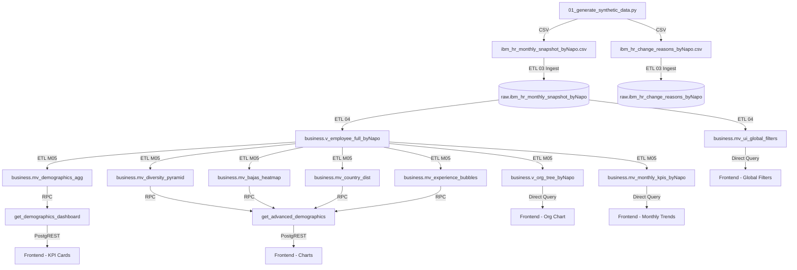

# Data Dictionary & Lineage — HR Analytics Dashboard

> **Generado automaticamente:** 2026-04-11T00:00:00Z
> **Ejecutado por:** Qwen Code Terminal
> **Source:** Analisis de scripts en `etl_pipeline/`

---

## 1. Arquitectura de Datos (Vision General)



**Flujo de datos:**

1. **Generacion (ETL 01):** Se generan datos sinteticos mensuales con reglas de negocio (IPC, rotacion, geolocalizacion).
2. **DDL (ETL 02):** Se crean las tablas de la capa RAW en PostgreSQL.
3. **Ingesta (ETL 03):** Los CSVs se cargan en tablas `raw.*`.
4. **Business Core (ETL 04):** Se crea la vista maestra `v_employee_full_byNapo` con columnas calculadas y la MV de filtros globales.
5. **Data Marts (ETL M05):** Se construyen vistas y materialized views especificas para el modulo de Fuerza Laboral, junto con funciones RPC para el frontend.

---

## 2. Capa RAW (Bronce)

### Tabla: `raw.ibm_hr_monthly_snapshot_byNapo`

Origen: `02_setup_raw_layer.py` + `03_ingest_data.py`
Descripcion: Tabla principal de snapshots mensuales de empleados. Todos los campos son de tipo TEXT (cadena) ya que la capa RAW almacena datos sin transformar.

| Columna | Tipo (RAW) | Descripcion | Origen |
|---------|-----------|-------------|--------|
| snapshot_date | TEXT | Fecha de corte del snapshot mensual (YYYY-MM-DD) | (C) ETL 01 |
| employee_id | TEXT | Identificador numerico unico del empleado | (F) CSV |
| employee_code | TEXT | Codigo legible del empleado (formato EMP-XXXXX) | (F) CSV |
| full_name | TEXT | Nombre completo del empleado | (F) CSV |
| gender | TEXT | Genero (Male / Female) | (F) CSV |
| nationality_iso3 | TEXT | Codigo ISO 3 del pais de nacionalidad | (F) CSV |
| country_iso3 | TEXT | Codigo ISO 3 del pais de trabajo (PER, CHL, COL, MEX, ESP, USA) | (F) CSV |
| department_name | TEXT | Departamento (IT, Sales, HR, Finance, Operations) | (F) CSV |
| job_role | TEXT | Rol especifico del empleado | (F) CSV |
| job_level_1 | TEXT | Nivel jerarquico alto (Management, Individual Contributor) | (F) CSV |
| job_level_2 | TEXT | Sub-nivel (Senior, Junior, Lead) | (F) CSV |
| employment_status | TEXT | Estado laboral (Active, Terminated) | (F) CSV |
| hire_date | TEXT | Fecha de contratacion (YYYY-MM-DD) | (F) CSV |
| termination_date | TEXT | Fecha de terminacion (YYYY-MM-DD), NULL si activo | (F) CSV |
| termination_reason_legal | TEXT | Motivo legal de terminacion (TER-VOL, TER-INV, TER-RET) | (F) CSV |
| turnover_classification_company | TEXT | Clasificacion de rotacion (Regrettable, Non-Regrettable) | (F) CSV |
| monthly_salary_local | TEXT | Salario mensual en moneda local | (F) CSV |
| currency_iso3 | TEXT | Codigo ISO 3 de moneda (PEN, EUR, USD, CLP, COP, MXN) | (F) CSV |
| fx_rate_to_usd | TEXT | Tasa de cambio a USD (valor fijo 3.50) | (C) ETL 01 |
| monthly_salary_usd | TEXT | Salario mensual convertido a USD | (C) ETL 01 |
| manager_employee_id | TEXT | ID del manager directo | (F) CSV |
| dotted_line_manager_id | TEXT | ID del manager secundario (siempre NULL en datos sinteticos) | (F) CSV |
| work_center_id | TEXT | ID del centro de trabajo (formato WC-XXX) | (F) CSV |
| home_lat | TEXT | Latitud del domicilio | (F) CSV |
| home_lon | TEXT | Longitud del domicilio | (F) CSV |
| work_modality | TEXT | Modalidad de trabajo (Remote, Hybrid, On-Site) | (F) CSV |
| education_level | TEXT | Nivel educativo (Bachelor, Master, PhD, Technical) | (F) CSV |
| education_status | TEXT | Estado educativo (Graduated en datos sinteticos) | (F) CSV |
| marital_status | TEXT | Estado civil (Single, Married, Divorced) | (F) CSV |
| dependents_count | TEXT | Numero de dependientes (0-3) | (F) CSV |
| salary_change_flag | TEXT | Indicador si hubo cambio salarial en el mes (0/1) | (F) CSV |
| salary_change_reason_code | TEXT | Codigo del motivo de cambio salarial (SAL-IPC, etc.) | (F) CSV |
| job_change_flag | TEXT | Indicador si hubo cambio de puesto (siempre 0 en datos sinteticos) | (F) CSV |
| exit_interview_completed | TEXT | Si completo entrevista de salida (Y/N, NULL si activo) | (F) CSV |
| regrettable_loss_flag | TEXT | Si la perdida es lamentable (Y/N, NULL si activo) | (F) CSV |
| created_at | TIMESTAMP WITH TIME ZONE | Marca de tiempo de creacion del registro | (C) DDL DEFAULT NOW() |

### Tabla: `raw.ibm_hr_change_reasons_byNapo`

Origen: `02_setup_raw_layer.py` + `03_ingest_data.py`
Descripcion: Catalogo de motivos de cambio salarial o laboral.

| Columna | Tipo (RAW) | Descripcion | Origen |
|---------|-----------|-------------|--------|
| reason_code | TEXT | Codigo unico del motivo | (F) CSV |
| reason_name_es | TEXT | Nombre del motivo en espanol | (F) CSV |
| reason_name_en | TEXT | Nombre del motivo en ingles | (F) CSV |
| affects_salary | TEXT | Indicador si afecta salario (Y/N) | (F) CSV |
| affects_job | TEXT | Indicador si afecta puesto (Y/N) | (F) CSV |
| active_flag | TEXT | Indicador si el motivo esta activo (Y/N) | (F) CSV |
| created_at | TIMESTAMP WITH TIME ZONE | Marca de tiempo de creacion | (C) DDL DEFAULT NOW() |

Catalogo de motivos (datos de `01_generate_synthetic_data.py`):

| reason_code | reason_name_es | affects_salary | affects_job |
|-------------|---------------|----------------|-------------|
| SAL-IPC | Ajuste por Inflacion (IPC) | Y | N |
| TER-VOL | Renuncia Voluntaria | N | Y |
| TER-INV | Despido Injustificado | N | Y |
| TER-RET | Jubilacion | N | Y |

---

## 3. Capa BUSINESS CORE (Plata/Oro Transversal)

### Vista Maestra: `business.v_employee_full_byNapo`

Origen: `04_setup_business_core.py`
Descripcion: Vista unica que transforma la capa RAW tipando columnas y agregando campos calculados. Es la **fuente de verdad** para todas las capas superiores.

| Columna | Tipo | Descripcion | Origen |
|---------|------|-------------|--------|
| snapshot_date | DATE | Fecha de corte | (F) CAST |
| employee_id | INTEGER | ID unico del empleado | (F) CAST |
| employee_code | TEXT | Codigo del empleado | (F) |
| full_name | TEXT | Nombre completo | (F) |
| gender | TEXT | Genero | (F) |
| country_iso3 | TEXT | Pais de trabajo | (F) |
| department_name | TEXT | Departamento | (F) |
| job_role | TEXT | Rol | (F) |
| job_level_1 | TEXT | Nivel jerarquico 1 | (F) |
| job_level_2 | TEXT | Nivel jerarquico 2 | (F) |
| employment_status | TEXT | Estado laboral | (F) |
| hire_date | DATE | Fecha de contratacion | (F) CAST |
| termination_date | DATE | Fecha de terminacion | (F) CAST |
| monthly_salary_local | NUMERIC(12,2) | Salario en moneda local | (F) CAST |
| currency_iso3 | TEXT | Moneda ISO | (F) |
| fx_rate_to_usd | NUMERIC(10,4) | Tasa de cambio a USD | (F) CAST |
| monthly_salary_usd | NUMERIC(12,2) | Salario en USD | (F) CAST |
| work_center_id | TEXT | Centro de trabajo | (F) |
| manager_employee_id | INTEGER | ID del manager directo | (F) CAST con NULLIF |
| tenure_months | NUMERIC | Meses de antiguedad en la empresa | (C) Ver regla abajo |
| is_active_at_snapshot | BOOLEAN | Si estaba activo en la fecha del snapshot | (C) Ver regla abajo |
| processed_at | TIMESTAMP WITH TIME ZONE | Marca de procesamiento | (C) NOW() |

**Reglas de negocio aplicadas:**

- **`tenure_months` (C):** Calcula la antiguedad en meses. Si el empleado tiene `termination_date`, usa `AGE(termination_date, hire_date)`. Si no, usa `AGE(snapshot_date, hire_date)`. La formula es: `EXTRACT(YEAR FROM AGE(...)) * 12 + EXTRACT(MONTH FROM AGE(...))`.
- **`is_active_at_snapshot` (C):** Determina si el empleado estaba activo en la fecha del snapshot. Logica:
  - `TRUE` si `employment_status = 'Active'`
  - `TRUE` si `termination_date IS NULL`
  - `TRUE` si `termination_date >= snapshot_date`
  - `FALSE` en cualquier otro caso

### Vista de Filtros: `business.mv_ui_global_filters`

Origen: `04_setup_business_core.py`
Descripcion: Vista materializada que expone las dimensiones disponibles para los filtros globales del frontend. Devuelve un unico JSON con 6 arrays.

| Dimension | Fuente en `v_employee_full_byNapo` | Descripcion |
|-----------|-----------------------------------|-------------|
| periods | DISTINCT snapshot_date (orden DESC) | Todas las fechas de corte disponibles |
| countries | DISTINCT country_iso3 (orden ASC) | Paises con datos |
| departments | DISTINCT department_name (orden ASC) | Departamentos |
| job_levels_1 | DISTINCT job_level_1 (orden ASC) | Niveles jerarquicos primarios |
| job_levels_2 | DISTINCT job_level_2 (orden ASC) | Niveles jerarquicos secundarios |
| work_centers | DISTINCT work_center_id (orden ASC) | Centros de trabajo |

---

## 4. Capa DATA MARTS (Oro Especifica)

### Modulo: Fuerza Laboral (m05)

Origen: `m05_fuerza_laboral.py`

#### Vista: `business.v_org_tree_byNapo`

| Atributo | Detalle |
|----------|---------|
| Tipo | Vista (no materializada) |
| Metricas | employee_id, full_name, job_role, job_level_1, depth, echarts_node (JSON) |
| Grafico Frontend | Organigrama jerarquico (ECharts tree) |
| Descripcion | Construye el arbol organizacional mediante CTE recursivo. Parte de los empleados sin manager (o cuyo manager no existe) en el snapshot mas reciente y recursivamente agrega subordinados hasta profundidad 10. Genera nodos en formato ECharts. |

#### MV: `business.mv_monthly_kpis_byNapo`

| Atributo | Detalle |
|----------|---------|
| Tipo | Vista Materializada |
| Dimensiones de agrupacion | snapshot_date, country_iso3 |
| Metricas | headcount_active (COUNT donde is_active_at_snapshot=TRUE), headcount_terminated (COUNT donde FALSE), avg_salary_usd (AVG monthly_salary_usd activos), avg_tenure (AVG tenure_months activos) |
| Grafico Frontend | Lineas de tendencia mensual por pais |
| Indice unico | idx_kpis_unique_m05 (snapshot_date, country_iso3) |

#### MV: `business.mv_demographics_agg`

| Atributo | Detalle |
|----------|---------|
| Tipo | Vista Materializada |
| Dimensiones de agrupacion | snapshot_date, country_iso3, department_name, job_level_1, job_level_2, work_center_id |
| Metricas | total_hc (COUNT), altas (COUNT donde hire_date en el mes), bajas (COUNT donde termination_date en el mes) |
| Grafico Frontend | Cards de KPI principal (Fuerza Laboral, Altas, Bajas) |
| Indices | idx_demo_agg_snap_m05 (snapshot_date), idx_demo_agg_filt_m05 (snapshot_date, country_iso3, department_name) |

#### MV: `business.mv_diversity_pyramid`

| Atributo | Detalle |
|----------|---------|
| Tipo | Vista Materializada |
| Dimensiones de agrupacion | snapshot_date, country_iso3, department_name, job_level_1, job_level_2, work_center_id, gender |
| Metricas | value (COUNT de empleados activos por genero) |
| Grafico Frontend | Piramide de diversidad / Barras apiladas por genero |
| Filtro | Solo empleados con is_active_at_snapshot = TRUE |
| Indice | idx_mv_div_snap_m05 (snapshot_date) |

#### MV: `business.mv_bajas_heatmap`

| Atributo | Detalle |
|----------|---------|
| Tipo | Vista Materializada |
| Dimensiones de agrupacion | snapshot_date, country_iso3, department_name, job_level_1, job_level_2, work_center_id |
| Metricas | count (COUNT de bajas del mes) |
| Grafico Frontend | Heatmap de rotacion/terminaciones por departamento y mes |
| Filtro | termination_date BETWEEN DATE_TRUNC('month', snapshot_date) AND snapshot_date |
| Indice | idx_mv_bajas_snap_m05 (snapshot_date) |

#### MV: `business.mv_country_dist`

| Atributo | Detalle |
|----------|---------|
| Tipo | Vista Materializada |
| Dimensiones de agrupacion | snapshot_date, country_iso3, department_name, job_level_1, job_level_2, work_center_id |
| Metricas | value (COUNT de empleados activos por pais) |
| Grafico Frontend | Distribucion geografica / Pie o barras por pais |
| Filtro | Solo empleados con is_active_at_snapshot = TRUE |
| Indice | idx_mv_country_snap_m05 (snapshot_date) |

#### MV: `business.mv_experience_bubbles`

| Atributo | Detalle |
|----------|---------|
| Tipo | Vista Materializada |
| Dimensiones de agrupacion | snapshot_date, country_iso3, department_name, job_level_1, job_level_2, work_center_id, generation, tenure_bucket |
| Metricas | generation (categoria: '< 1 ano', '1-3 anos', '3-6 anos', '6+ anos'), tenure_bucket (tenure_months redondeado al multiplo de 6 inferior), avg_salary (AVG monthly_salary_usd redondeado), emp_count (COUNT) |
| Grafico Frontend | Bubble chart de experiencia vs salario |
| Filtro | is_active_at_snapshot = TRUE AND tenure_months IS NOT NULL AND monthly_salary_usd IS NOT NULL |
| Indice | idx_mv_exp_snap_m05 (snapshot_date) |

---

## 5. Funciones RPC

Ambas funciones son consumidas por **Supabase PostgREST** desde el frontend.

### `business.get_demographics_dashboard`

| Atributo | Detalle |
|----------|---------|
| Parametros | `p_period_date DATE`, `p_country TEXT DEFAULT NULL`, `p_department TEXT DEFAULT NULL`, `p_job_level_1 TEXT DEFAULT NULL`, `p_job_level_2 TEXT DEFAULT NULL`, `p_work_center TEXT DEFAULT NULL` |
| Retorno | JSON |
| Descripcion | Calcula 3 tarjetas de KPI con comparaciones MoM y YoY, cada una con sparkline de 6-12 meses. |
| Componente Frontend | Cards de resumen: "FUERZA LABORAL", "ALTAS DEL MES", "BAJAS DEL MES" |

Estructura del JSON retornado por cada card (`total_activos_card`, `altas_card`, `bajas_card`):

| Campo | Tipo | Descripcion |
|-------|------|-------------|
| title | TEXT | Titulo de la tarjeta |
| current_month | TEXT | Mes actual (YYYY.MM) |
| current_value | NUMERIC | Valor del mes actual |
| previous_month | TEXT | Mes anterior (YYYY.MM) |
| previous_value | NUMERIC | Valor del mes anterior |
| diff_abs | NUMERIC | Diferencia absoluta (current - previous) |
| diff_pct | NUMERIC | Diferencia porcentual |
| yoy_month | TEXT | Mes del ano anterior (YYYY.MM) |
| yoy_value | NUMERIC | Valor del mismo mes ano anterior |
| yoy_diff_abs | NUMERIC | Diferencia YoY absoluta |
| yoy_diff_pct | NUMERIC | Diferencia YoY porcentual |
| sparkline_data | JSON[] | Serie historica para grafico de linea (label, value) |

**Logica interna:**
- **`total_activos_card`:** Usa `mv_demographics_agg` para sumar `total_hc`.
- **`altas_card`:** Usa `mv_demographics_agg` para sumar `altas`. Sparkline de ultimos 6 meses.
- **`bajas_card`:** Usa `mv_demographics_agg` para sumar `bajas`. Sparkline de ultimos 6 meses.
- La tendencia historica abarca 12 meses (`p_period_date - INTERVAL '11 months'` a `p_period_date`).
- El punto YoY compara con `p_period_date - INTERVAL '1 year'`.
- Todos los filtros (country, department, job_level_1, job_level_2, work_center) son opcionales y se aplican con logica NULL-or-equals.

### `business.get_advanced_demographics`

| Atributo | Detalle |
|----------|---------|
| Parametros | `p_period_date DATE`, `p_country TEXT DEFAULT NULL`, `p_department TEXT DEFAULT NULL`, `p_job_level_1 TEXT DEFAULT NULL`, `p_job_level_2 TEXT DEFAULT NULL`, `p_work_center TEXT DEFAULT NULL` |
| Retorno | JSON |
| Descripcion | Retorna 4 conjuntos de datos para graficos avanzados de demografia. |
| Componente Frontend | Piramide de diversidad, Heatmap de rotacion, Distribucion por pais, Bubble chart de experiencia |

Estructura del JSON retornado:

| Clave JSON | Fuente | Campos por registro | Grafico |
|------------|--------|---------------------|---------|
| `diversity_pyramid` | `mv_diversity_pyramid` | level (job_level_2), gender, value (SUM) | Barras apiladas por genero |
| `turnover_heatmap` | `mv_bajas_heatmap` | dept (department_name), month_label (YYYY.MM), count (SUM) | Heatmap departamental 12 meses |
| `country_distribution` | `mv_country_dist` | name (country_iso3), value (SUM) | Pie / barras horizontales |
| `experience_bubbles` | `mv_experience_bubbles` | generation, tenure_months, salary (promedio ponderado), count (SUM) | Bubble chart (tamano=count, X=tenure, Y=salary) |

**Logica interna:**
- `diversity_pyramid`: Filtra por `snapshot_date = p_period_date` y dimensiones opcionales. Agrupa por `job_level_2` y `gender`.
- `turnover_heatmap`: Rango de 12 meses (`p_period_date - INTERVAL '12 months'` a `p_period_date`). Agrupa por `department_name` y mes.
- `country_distribution`: Filtra por snapshot actual. Agrupa por `country_iso3`.
- `experience_bubbles`: Calcula salario promedio ponderado: `SUM(avg_salary * emp_count) / NULLIF(SUM(emp_count), 0)`.

---

## 6. Reglas de Simulacion

Fuente: `01_generate_synthetic_data.py`

### IPC (Inflacion)

- **Configuracion por pais:**

| Pais | Tasa anual | Mes de aplicacion |
|------|-----------|-------------------|
| PER (Peru) | 4% | Febrero (mes 2) |
| ESP (Espana) | 3% | Enero (mes 1) |
| CHL (Chile) | 3.5% | Julio (mes 7) |

- **Mecanica:** Cada mes, si el mes calendario coincide con el mes configurado del pais, se aplica un incremento al salario: `monthly_salary_local *= (1 + rate)`. Se marca `salary_change_flag = 1` y `salary_change_reason_code = 'SAL-IPC'`.

### Rotacion (Attrition)

- **Tasa:** 0.5% mensual (`attrition_rate = 0.005`).
- **Mecanica:** Cada mes, un 0.5% de los empleados activos son seleccionados aleatoriamente para terminar.
- **Excepcion:** El CEO (`employee_id = 1`) **nunca** es seleccionado para terminacion ("CEO Inmortal").
- **Distribucion de motivos:**
  - 70% Renuncia Voluntaria (TER-VOL)
  - 20% Despido Injustificado (TER-INV)
  - 10% Jubilacion (TER-RET)
- **Clasificacion adicional:** Se asigna aleatoriamente `turnover_classification_company` (Regrettable/Non-Regrettable), `exit_interview_completed` (Y/N), `regrettable_loss_flag` (Y/N).
- **Reasignacion de manager:** Si un manager es terminado, sus subordinados directos ("huerfanos") se reasignan aleatoriamente a otros managers activos.

### Coordenadas Geograficas

- Cada pais tiene coordenadas centrales configuradas. Las coordenadas individuales se generan con una variacion aleatoria uniforme de +/- 0.05 grados respecto al centro del pais.

| Pais | Latitud central | Longitud central |
|------|----------------|------------------|
| PER | -12.0464 | -77.0428 |
| CHL | -33.4489 | -70.6693 |
| COL | 4.6097 | -74.0817 |
| MEX | 19.4326 | -99.1332 |
| ESP | 40.4168 | -3.7038 |
| USA | 40.7128 | -74.0060 |

### Moneda y Tasa de Cambio

- **Mapeo pais-moneda:**

| Pais | Moneda ISO |
|------|-----------|
| PER | PEN |
| ESP | EUR |
| USA | USD |
| CHL | CLP |
| COL | COP |
| MEX | MXN |

- **Tasa de cambio a USD:** Valor **fijo** de 3.50 para todos los registros (simplificacion de simulacion).
- **Conversion:** `monthly_salary_usd = monthly_salary_local / fx_rate_to_usd` (redondeado a 2 decimales).

### Generacion de Empleados

- **Rango de fechas:** 2020-01-01 a 2026-03-31 (snapshots de fin de mes).
- **Empleados iniciales:** 4000 (semilla).
- **Nuevos hires mensuales:** 1% del minimo (40 empleados nuevos por mes), todos como "Individual Contributor" / "Junior" del departamento IT.
- **Distribucion de modalidades de trabajo:** Remote 20%, Hybrid 50%, On-Site 30%.
- **Distribucion de estado civil:** Single 50%, Married 40%, Divorced 10%.
- **Distribucion de job_level_1:** Management 15%, Individual Contributor 85%.
- **Dependientes:** Numero aleatorio entero entre 0 y 3.
- **Rango salarial inicial:** Uniforme entre 1500 y 5000 (moneda local).

### Semilla Aleatoria

- `RANDOM_SEED = 42` para reproducibilidad total.

---

## 7. Diagrama ER

```mermaid
erDiagram
    RAW_SNAPSHOT ||--o{ BUSINESS_VIEW : "1:N transformada"
    RAW_SNAPSHOT["raw.ibm_hr_monthly_snapshot_byNapo"] {
        TEXT snapshot_date PK
        TEXT employee_id PK
        TEXT employee_code
        TEXT full_name
        TEXT gender
        TEXT country_iso3
        TEXT department_name
        TEXT job_role
        TEXT job_level_1
        TEXT job_level_2
        TEXT employment_status
        TEXT hire_date
        TEXT termination_date
        TEXT monthly_salary_local
        TEXT currency_iso3
        TEXT fx_rate_to_usd
        TEXT monthly_salary_usd
        TEXT manager_employee_id
        TEXT work_modality
        TEXT work_center_id
        TEXT home_lat
        TEXT home_lon
        TEXT education_level
        TEXT marital_status
        TEXT dependents_count
        TEXT salary_change_flag
        TEXT salary_change_reason_code
    }

    BUSINESS_VIEW["business.v_employee_full_byNapo"] {
        DATE snapshot_date PK
        INTEGER employee_id PK
        INTEGER tenure_months
        BOOLEAN is_active_at_snapshot
    }

    BUSINESS_VIEW ||--o{ MV_DEMOGRAPHICS : "agrupa por"
    MV_DEMOGRAPHICS["business.mv_demographics_agg"] {
        DATE snapshot_date PK
        TEXT country_iso3 PK
        TEXT department_name PK
        BIGINT total_hc
        BIGINT altas
        BIGINT bajas
    }

    BUSINESS_VIEW ||--o{ MV_MONTHLY_KPIS : "agrupa por"
    MV_MONTHLY_KPIS["business.mv_monthly_kpis_byNapo"] {
        DATE snapshot_date PK
        TEXT country_iso3 PK
        BIGINT headcount_active
        BIGINT headcount_terminated
        NUMERIC avg_salary_usd
        NUMERIC avg_tenure
    }

    BUSINESS_VIEW ||--o{ MV_DIVERSITY : "agrupa por"
    MV_DIVERSITY["business.mv_diversity_pyramid"] {
        DATE snapshot_date PK
        TEXT country_iso3 PK
        TEXT gender PK
        BIGINT value
    }

    BUSINESS_VIEW ||--o{ MV_BAJAS : "filtra terminados"
    MV_BAJAS["business.mv_bajas_heatmap"] {
        DATE snapshot_date PK
        TEXT department_name PK
        BIGINT count
    }

    BUSINESS_VIEW ||--o{ MV_COUNTRY : "agrupa por"
    MV_COUNTRY["business.mv_country_dist"] {
        DATE snapshot_date PK
        TEXT country_iso3 PK
        BIGINT value
    }

    BUSINESS_VIEW ||--o{ MV_EXPERIENCE : "agrupa por"
    MV_EXPERIENCE["business.mv_experience_bubbles"] {
        DATE snapshot_date PK
        TEXT generation PK
        INTEGER tenure_bucket PK
        NUMERIC avg_salary
        BIGINT emp_count
    }

    RAW_REASONS["raw.ibm_hr_change_reasons_byNapo"] {
        TEXT reason_code PK
        TEXT reason_name_es
        TEXT reason_name_en
        TEXT affects_salary
        TEXT affects_job
    }

    MV_DEMOGRAPHICS --> RPC_DASHBOARD : "consume"
    MV_DIVERSITY --> RPC_ADVANCED : "consume"
    MV_BAJAS --> RPC_ADVANCED : "consume"
    MV_COUNTRY --> RPC_ADVANCED : "consume"
    MV_EXPERIENCE --> RPC_ADVANCED : "consume"

    RPC_DASHBOARD["get_demographics_dashboard()"] {
        JSON result
    }
    RPC_ADVANCED["get_advanced_demographics()"] {
        JSON result
    }
```
