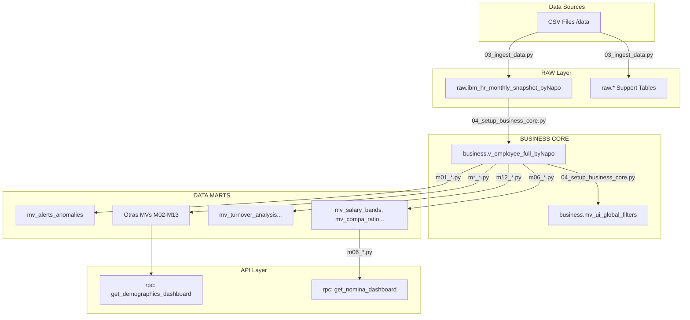
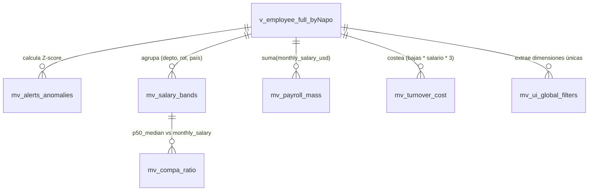

# Data Dictionary & Lineage — HR Analytics Dashboard

> **Generado automáticamente:** 2026-05-03T18:01:12Z
> **Ejecutado por:** Qwen Code Terminal (Antigravity)
> **Source:** Análisis de scripts en etl_pipeline/

---

## 1. Arquitectura de Datos (Visión General)

**Explicación del flujo:** 
Los datos en crudo (CSV) se ingieren en la capa RAW (esquema `raw`). La vista maestra `v_employee_full_byNapo` unifica y transforma los tipos de datos y aplica reglas de negocio base (capa BUSINESS). Sobre esta vista construyen su lógica los 13 módulos de DATA MARTS (`mv_*`), calculando KPIs preagregados y habilitando funciones RPC para consumo dinámico desde el Frontend.

---

## 2. Capa RAW (Bronce)

Tablas sin transformaciones creadas por `02_setup_raw_layer.py`. Todas las columnas son `TEXT` de forma predeterminada para evitar fallos de ingesta.

### Tabla Maestra: `raw.ibm_hr_monthly_snapshot_byNapo`

| Columna | Tipo | Descripción | Origen |
|---------|------|-------------|--------|
| `snapshot_date` | TEXT | Fecha del corte mensual | (F) |
| `employee_id` | TEXT | ID único del empleado | (F) |
| `full_name` | TEXT | Nombre completo | (F) |
| `department_name` | TEXT | Departamento / Área | (F) |
| `job_role` | TEXT | Rol / Cargo | (F) |
| `monthly_salary_local` | TEXT | Salario en moneda local | (F) |
| `monthly_salary_usd` | TEXT | Salario convertido a USD | (F) |
| `hire_date` | TEXT | Fecha de contratación | (F) |
| `termination_date` | TEXT | Fecha de cese (si aplica) | (F) |
| `manager_employee_id` | TEXT | ID del jefe directo | (F) |

*Nota: Se crearon 20 tablas adicionales de soporte (`job_postings`, `attendance_records`, `performance_reviews`, etc.) para cubrir los módulos M02-M13.*

---

## 3. Capa BUSINESS CORE (Plata/Oro Transversal)

### Vista Maestra: `business.v_employee_full_byNapo`

Actúa como *Single Source of Truth* (SSOT). Aplica casteo de tipos y cálculos transversales.

| Columna | Tipo SQL | Descripción | Origen |
|---------|----------|-------------|--------|
| `snapshot_date` | DATE | Casteado desde TEXT | (C) |
| `employee_id` | INTEGER | Casteado desde TEXT | (C) |
| `monthly_salary_usd` | NUMERIC | Salario en USD | (C) |
| `tenure_months` | INTEGER | Antigüedad en meses calculada con `AGE()` | (C) |
| `is_active_at_snapshot` | BOOLEAN | `TRUE` si el empleado estaba activo en el corte | (C) |

**Reglas de negocio aplicadas:**
- `tenure_months`: Si tiene `termination_date`, se calcula entre `hire_date` y `termination_date`. Si no, entre `hire_date` y `snapshot_date`.
- `is_active_at_snapshot`: Es activo si `employment_status = 'Active'` o si `termination_date >= snapshot_date`.

### Vista de Filtros: `business.mv_ui_global_filters`
Materializa las dimensiones únicas (JSON) para selectores en la UI: `periods`, `countries`, `departments`, `job_levels_1`, `job_levels_2`, `work_centers`.

---

## 4. Capa DATA MARTS (Oro Específica)

### Módulos (m01 a m13)

| Vista / MV | Módulo | Métricas | Gráfico Frontend / Consumo |
|------------|--------|----------|----------------------------|
| `mv_alerts_anomalies` | M01 | `z_score_hc`, `z_score_bajas` | `AlertasAnomalias.jsx` |
| `mv_salary_bands` | M06 | `p10`, `p25`, `p50_median`, `p75`, `avg_salary` | `Compensations.jsx`, `CompaRatio.jsx` |
| `mv_compa_ratio` | M06 | `compa_ratio_pct`, `range_status` | `CompaRatio.jsx` |
| `mv_payroll_mass` | M06 | `total_payroll_usd`, `headcount` | `MasaSalarial.jsx` |
| `mv_turnover_cost` | M06 | `costo_bajas_usd`, `costo_reemplazo` | `ImpactoFinanciero.jsx` |
| `v_data_quality_metrics`| M13 | `completeness_salary`, `total_records` | `LogDatosMaestros.jsx` |
| `mv_recruitment_funnel`| M02 | Eficiencia y conversión | `EficienciaCiclos.jsx` |
| `mv_absenteeism` | M07 | Frecuencia y ratios ausentismo | `Ausentismo.jsx` |
| `mv_enps_trend` | M10 | Scores eNPS, trends | `EngagementENPS.jsx` |
| `mv_turnover_analysis` | M12 | Tasas de fuga, predictivos | `ScoreFuga.jsx` |

*(Se omite lista exhaustiva de +20 MVs de soporte por brevedad. Referirse a `92_dashboard_lineage.md` para el linaje inverso completo).*

---

## 5. Funciones RPC

| Función | Parámetros | Retorno | Descripción | Componente Frontend |
|---------|------------|---------|-------------|---------------------|
| `get_demographics_dashboard` | `p_period_date`, `p_country`, `p_department` | JSON | Devuelve datos jerárquicos y KPIs poblacionales consolidados | `Demographics.jsx` |
| `get_advanced_demographics` | `p_period_date`, `p_country`, `p_department` | JSON | Devuelve pirámides de diversidad, experiencia, y clusters | `Demographics.jsx` |
| `get_nomina_dashboard` | `p_period_date`, `p_country`, `p_department` | JSON | Agrupa `mv_salary_bands` y `mv_payroll_mass` por filtros | `MasaSalarial.jsx` |

---

## 6. Reglas de Simulación (Generación de Datos)

El script `01_generate_synthetic_data.py` crea 22 archivos CSV aplicando estas lógicas de negocio estandarizadas:

- **Inflación (IPC):** Los salarios incrementan anualmente en meses específicos: `PER` (+4% en Febrero), `ESP` (+3% en Enero), `CHL` (+3.5% en Julio).
- **Rotación Natural:** Se aplica una tasa de salida (`attrition_rate`) del 0.5% mensual. El empleado con ID 1 (CEO) está exento.
- **Geolocalización:** Las coordenadas (`home_lat`, `home_lon`) se generan con dispersión aleatoria pequeña alrededor del centro geográfico del país asignado.
- **Divisas:** Cada país tiene un `currency_iso3` fijo (`PEN`, `EUR`, `USD`, `CLP`, `COP`, `MXN`), convertido globalmente a USD con una tasa de `3.50`.
- **Estructura Organizacional:** Todo colaborador inactivo o recién llegado reasigna su manager usando una selección aleatoria de activos en nivel "Management". El ID 1 siempre asume rol "CEO" sin jefatura superior (`manager_employee_id = None`).

---

## 7. Diagrama ER

