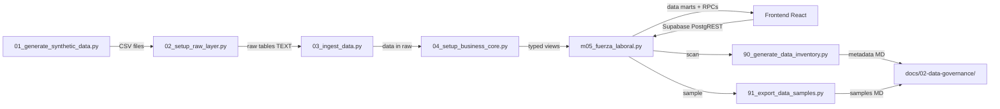
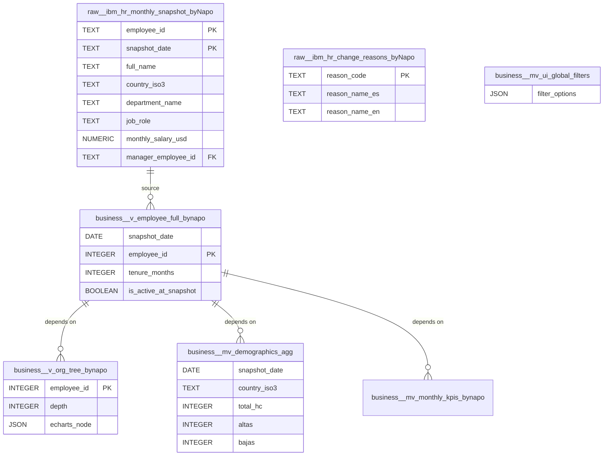

# Data Dictionary & Lineage — HR Analytics Dashboard

> **Generado automáticamente:** 2026-04-11T06:32:00Z
> **Ejecutado por:** Qwen Code Terminal
> **Source:** Análisis de scripts en `etl_pipeline/`
> **Versión del Pipeline:** Scripts 01-04 + m05 + 90-91

---

## 1. Arquitectura de Datos (Visión General)

El pipeline implementa una arquitectura **Medallion** (Bronce → Plata → Oro):

**Motor:** PostgreSQL (Supabase)
**Esquemas principales:** `raw` (capa bronce), `business` (capa plata/oro)
**Total de objetos:** 13 (2 tablas + 2 vistas + 7 vistas materializadas + 2 funciones RPC)

---

## 2. Capa RAW (Bronce — Aterrizaje)

### Tabla: `raw."ibm_hr_monthly_snapshot_byNapo"`

Script origen: `02_setup_raw_layer.py`

**Propósito:** Landing de snapshots mensuales. Todos los columnas son `TEXT` para evitar errores de tipo durante la ingesta CSV. La tipificación se aplica en la capa Business.

| Columna | Tipo (SQL) | Descripción | ¿Calc. o Fuente? |
|---------|------------|-------------|-----------------|
| `snapshot_date` | TEXT | Fecha de snapshot mensual (YYYY-MM-DD) | (F) |
| `employee_id` | TEXT | ID único del empleado | (F) |
| `employee_code` | TEXT | Código legible (ej. EMP-00001) | (F) |
| `full_name` | TEXT | Nombre completo | (F) |
| `gender` | TEXT | Género (Male/Female) | (F) |
| `nationality_iso3` | TEXT | Nacionalidad ISO 3166-1 alpha-3 | (F) |
| `country_iso3` | TEXT | País de trabajo ISO 3166-1 alpha-3 | (F) |
| `department_name` | TEXT | Departamento (IT, Sales, HR, Finance, Operations) | (F) |
| `job_role` | TEXT | Título del cargo | (F) |
| `job_level_1` | TEXT | Nivel superior (Management / Individual Contributor) | (F) |
| `job_level_2` | TEXT | Nivel secundario (Senior / Junior / Lead) | (F) |
| `employment_status` | TEXT | Estado (Active / Terminated) | (F) |
| `hire_date` | TEXT | Fecha de contratación | (F) |
| `termination_date` | TEXT | Fecha de término (nullable) | (F) |
| `termination_reason_legal` | TEXT | Código legal de término | (F) |
| `turnover_classification_company` | TEXT | Clasificación de rotación (Regrettable/Non-Regrettable) | (F) |
| `monthly_salary_local` | TEXT | Salario mensual en moneda local | (F) |
| `currency_iso3` | TEXT | Moneda ISO 4217 (PEN, EUR, USD, CLP, COP, MXN) | (F) |
| `fx_rate_to_usd` | TEXT | Tipo de cambio a USD | (F) |
| `monthly_salary_usd` | TEXT | Salario mensual en USD | (F) |
| `manager_employee_id` | TEXT | ID del manager directo | (F) |
| `dotted_line_manager_id` | TEXT | ID del manager secundario (siempre NULL) | (F) |
| `work_center_id` | TEXT | Centro de trabajo (ej. WC-PER) | (F) |
| `home_lat` | TEXT | Latitud de domicilio | (F) |
| `home_lon` | TEXT | Longitud de domicilio | (F) |
| `work_modality` | TEXT | Modalidad (Remote / Hybrid / On-Site) | (F) |
| `education_level` | TEXT | Nivel educativo (Bachelor / Master / PhD / Technical) | (F) |
| `education_status` | TEXT | Estado educativo (siempre "Graduated") | (F) |
| `marital_status` | TEXT | Estado civil (Single / Married / Divorced) | (F) |
| `dependents_count` | TEXT | Número de dependientes (0-3) | (F) |
| `salary_change_flag` | TEXT | Flag de cambio salarial | (F) |
| `salary_change_reason_code` | TEXT | Código de razón de cambio salarial | (F) |
| `job_change_flag` | TEXT | Flag de cambio de cargo (siempre 0) | (F) |
| `exit_interview_completed` | TEXT | Entrevista de salida completada (Y/N) | (F) |
| `regrettable_loss_flag` | TEXT | Flag de pérdida lamentable | (F) |
| `created_at` | TIMESTAMP WITH TIME ZONE | Timestamp de inserción (DEFAULT NOW()) | (F) |

**Total: 36 columnas**

### Tabla: `raw."ibm_hr_change_reasons_byNapo"`

Script origen: `02_setup_raw_layer.py`

**Propósito:** Catálogo de códigos de razón de cambio (dimensión).

| Columna | Tipo (SQL) | Descripción | ¿Calc. o Fuente? |
|---------|------------|-------------|-----------------|
| `reason_code` | TEXT | Código único (SAL-IPC, TER-VOL, TER-INV, TER-RET) | (F) |
| `reason_name_es` | TEXT | Nombre en español | (F) |
| `reason_name_en` | TEXT | Nombre en inglés | (F) |
| `affects_salary` | TEXT | Afecta salario (Y/N) | (F) |
| `affects_job` | TEXT | Afecta cargo (Y/N) | (F) |
| `active_flag` | TEXT | Código activo (Y/N) | (F) |
| `created_at` | TIMESTAMP WITH TIME ZONE | Timestamp de inserción | (F) |

**Total: 7 columnas**

---

## 3. Capa BUSINESS CORE (Plata/Oro Transversal)

### Vista Maestra: `business.v_employee_full_bynapo`

Script origen: `04_setup_business_core.py`

**Propósito:** Única base de verdad. Convierte columnas TEXT a tipos apropiados y agrega columnas calculadas.

| # | Columna | Tipo | Origen | Notas |
|---|---------|------|--------|-------|
| 1 | `snapshot_date` | DATE | (F) | `snapshot_date::DATE` |
| 2 | `employee_id` | INTEGER | (F) | `employee_id::INTEGER` |
| 3 | `employee_code` | TEXT | (F) | Pass-through |
| 4 | `full_name` | TEXT | (F) | Pass-through |
| 5 | `gender` | TEXT | (F) | Pass-through |
| 6 | `country_iso3` | TEXT | (F) | Pass-through |
| 7 | `department_name` | TEXT | (F) | Pass-through |
| 8 | `job_role` | TEXT | (F) | Pass-through |
| 9 | `job_level_1` | TEXT | (F) | Pass-through |
| 10 | `job_level_2` | TEXT | (F) | Pass-through |
| 11 | `employment_status` | TEXT | (F) | Pass-through |
| 12 | `hire_date` | DATE | (F) | `hire_date::DATE` |
| 13 | `termination_date` | DATE | (F) | `termination_date::DATE` |
| 14 | `monthly_salary_local` | NUMERIC(12,2) | (F) | Cast a numeric |
| 15 | `currency_iso3` | TEXT | (F) | Pass-through |
| 16 | `fx_rate_to_usd` | NUMERIC(10,4) | (F) | Cast a numeric |
| 17 | `monthly_salary_usd` | NUMERIC(12,2) | (F) | Cast a numeric |
| 18 | `work_center_id` | TEXT | (F) | Pass-through |
| 19 | `manager_employee_id` | INTEGER | (F) | `NULLIF(...)::NUMERIC::INTEGER` |
| 20 | `tenure_months` | INTEGER | **(C)** | **Regla:** `EXTRACT(YEAR FROM AGE(termination_date/snapshot_date, hire_date)) * 12 + EXTRACT(MONTH FROM AGE(...))` |
| 21 | `is_active_at_snapshot` | BOOLEAN | **(C)** | **Regla:** TRUE si employment_status='Active' O termination_date IS NULL O termination_date >= snapshot_date |
| 22 | `processed_at` | TIMESTAMP | **(C)** | `NOW()` — timestamp de procesamiento |

**Total: 22 columnas (19 fuente + 3 calculadas)**

### Vista Materializada de Filtros: `business.mv_ui_global_filters`

Script origen: `04_setup_business_core.py`

**Propósito:** Exponer los 6 filtros universales como un objeto JSON para los dropdowns del frontend.

| Dimensión | Columna Fuente | Formato |
|-----------|---------------|---------|
| `periods` | `snapshot_date` | `'YYYY-MM-DD'`, ordenado DESC |
| `countries` | `country_iso3` | Distinct non-null, alfabético |
| `departments` | `department_name` | Distinct non-null, alfabético |
| `job_levels_1` | `job_level_1` | Distinct non-null, alfabético |
| `job_levels_2` | `job_level_2` | Distinct non-null, alfabético |
| `work_centers` | `work_center_id` | Distinct non-null, alfabético |

---

## 4. Capa DATA MARTS (Oro Específica / Módulos)

### Módulo: Fuerza Laboral (`m05_fuerza_laboral.py`)

| Vista / Tabla | Tipo | Gráfico Frontend | Métricas | Descripción |
|---------------|------|-----------------|----------|-------------|
| `v_org_tree_bynapo` | Vista Recursiva | Árbol ECharts (org chart) | Jerarquía | Organigrama desde CEO hasta hojas, profundidad ≤ 10 |
| `mv_monthly_kpis_bynapo` | MV | Gráficos de tendencia mensual | headcount_active, headcount_terminated, avg_salary_usd, avg_tenure | KPIs por país y mes |
| `mv_demographics_agg` | MV | Tarjetas KPI (cards) | total_hc, altas, bajas | Agregados por snapshot/país/departamento/nivel/centro |
| `mv_diversity_pyramid` | MV | Pirámide de diversidad | value (count por género) | Conteos activos por género y nivel |
| `mv_bajas_heatmap` | MV | Heatmap de rotación | count (bajas) | Bajas por snapshot/país/departamento |
| `mv_country_dist` | MV | Distribución geográfica | value (count) | Distribución de activos por país |
| `mv_experience_bubbles` | MV | Burbujas experiencia/salario | avg_salary, emp_count, generation, tenure_bucket | Burbujas con tenure bucketed (<1 año, 1-3, 3-6, 6+) |

---

## 5. Funciones RPC de Supabase

| Función | Parámetros | Retorno | Descripción | Componente Frontend |
|---------|-----------|---------|-------------|---------------------|
| `get_demographics_dashboard` | `p_period_date` (DATE), `p_country` (TEXT), `p_department` (TEXT), `p_job_level_1` (TEXT), `p_job_level_2` (TEXT), `p_work_center` (TEXT) | JSON | 3 tarjetas (Fuerza Laboral, Altas, Bajas) con comparaciones MoM, YoY y sparklines | Módulo 05 Demografía — Cards principales |
| `get_advanced_demographics` | (mismos 6 parámetros) | JSON | 4 gráficos: diversity_pyramid, turnover_heatmap, country_distribution, experience_bubbles | Módulo 05 Demografía — Gráficos avanzados |

**Permisos:** `GRANT EXECUTE` a `anon` en ambas funciones.

---

## 6. Reglas de Simulación (Lógica de Negocio)

Script origen: `01_generate_synthetic_data.py`

### 6.1 Ajuste de IPC por Mes/País

| País | Tasa IPC | Mes de Aplicación | Efecto |
|------|----------|-------------------|--------|
| PER (Perú) | +4% | Febrero (mes 2) | Salario × 1.04 |
| ESP (España) | +3% | Enero (mes 1) | Salario × 1.03 |
| CHL (Chile) | +3.5% | Julio (mes 7) | Salario × 1.035 |

Cuando se aplica IPC: `salary_change_flag = 1`, `salary_change_reason_code = "SAL-IPC"`.

### 6.2 Rotación Natural

- **Tasa mensual:** 0.5% (0.005) de empleados activos
- **CEO (employee_id=1):** Inmune — nunca es despedido ni tiene manager

| Razón | Código | Probabilidad |
|-------|--------|-------------|
| Renuncia Voluntaria | TER-VOL | 70% |
| Despido Involuntario | TER-INV | 20% |
| Jubilación | TER-RET | 10% |

### 6.3 Contrataciones

- **Tasa:** 1% del pool base (4000) = **40 nuevos empleados/mes**
- **Nivel:** Todos como "Individual Contributor" / "Junior"
- **Salario:** Uniforme entre $1,000 y $3,000 (moneda local)
- **[⚠️ Nota]:** Todos los nuevos hires reciben roles de IT independientemente del departamento asignado — posible bug.

### 6.4 Tipo de Cambio

- **FX rate fijo:** 3.50 para TODOS los países y TODOS los meses
- `monthly_salary_usd = monthly_salary_local / 3.50`

### 6.5 Reasignación de Managers

- Empleados sin manager (no-CEO) reciben un manager aleatorio del pool de Management activos
- Si un manager es despedido, sus reportes directos se reasignan a managers activos aleatorios

### 6.6 Coordenadas Geográficas

Cada país tiene coordenadas centrales con jitter de ±0.05 grados:

| País | Lat | Lon |
|------|-----|-----|
| PER | -12.0464 | -77.0428 |
| CHL | -33.4489 | -70.6693 |
| COL | 4.6097 | -74.0817 |
| MEX | 19.4326 | -99.1332 |
| ESP | 40.4168 | -3.7038 |
| USA | 40.7128 | -74.0060 |

### 6.7 Datos Sintéticos "Fantasma"

Columnas pobladas con valores por defecto para "100% data quality":

| Columna | Valor |
|---------|-------|
| `nationality_iso3` | Copiado de `country_iso3` |
| `education_status` | Siempre `"Graduated"` |
| `dependents_count` | Random 0-3 |
| `dotted_line_manager_id` | Siempre NULL |
| `work_center_id` | `"WC-" + country_iso3` |
| `job_change_flag` | Siempre `0` |

### 6.8 Semilla Inicial

- **Pool inicial:** 4,000 empleados
- **Rango de fechas de contratación:** 100-2,000 días antes de 2020-01-01 (hasta ~mid-2014)
- **Salario seed:** Uniforme entre $1,500 y $5,000
- **Random seed:** 42 (determinístico)
- **Período:** 75 meses (2020-01 a 2026-03)

---

## 7. Diagrama ER Simplificado

---

## Inventario Completo de Objetos de Base de Datos

| # | Esquema | Objeto | Tipo | Script Origen |
|---|---------|--------|------|--------------|
| 1 | `raw` | `ibm_hr_monthly_snapshot_byNapo` | TABLE | 02 |
| 2 | `raw` | `ibm_hr_change_reasons_byNapo` | TABLE | 02 |
| 3 | `business` | `v_employee_full_bynapo` | VIEW | 04 |
| 4 | `business` | `mv_ui_global_filters` | MATERIALIZED VIEW | 04 |
| 5 | `business` | `v_org_tree_bynapo` | VIEW | m05 |
| 6 | `business` | `mv_monthly_kpis_bynapo` | MATERIALIZED VIEW | m05 |
| 7 | `business` | `mv_demographics_agg` | MATERIALIZED VIEW | m05 |
| 8 | `business` | `mv_diversity_pyramid` | MATERIALIZED VIEW | m05 |
| 9 | `business` | `mv_bajas_heatmap` | MATERIALIZED VIEW | m05 |
| 10 | `business` | `mv_country_dist` | MATERIALIZED VIEW | m05 |
| 11 | `business` | `mv_experience_bubbles` | MATERIALIZED VIEW | m05 |
| 12 | `business` | `get_demographics_dashboard` | FUNCTION (RPC) | m05 |
| 13 | `business` | `get_advanced_demographics` | FUNCTION (RPC) | m05 |

**Total: 13 objetos** (2 tablas + 2 vistas + 7 vistas materializadas + 2 funciones RPC)

---
